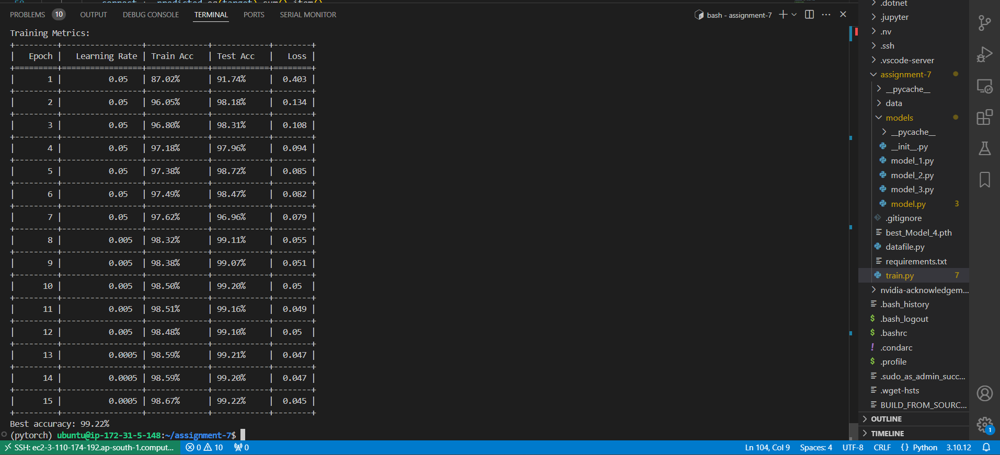

# MNIST Classification with PyTorch

A lightweight CNN architecture designed to achieve >99.4% accuracy on MNIST with less than 8,000 parameters and is trained in ec2 instance.

## Model Architecture

Model_4 Architecture:

---

Layer (type) Output Shape Param #

================================================================

Conv2d-1 [-1, 6, 28, 28] 54

BatchNorm2d-2 [-1, 6, 28, 28] 12

ReLU-3 [-1, 6, 28, 28] 0

Dropout-4 [-1, 6, 28, 28] 0

Conv2d-5 [-1, 12, 28, 28] 648

BatchNorm2d-6 [-1, 12, 28, 28] 24

ReLU-7 [-1, 12, 28, 28] 0

Dropout-8 [-1, 12, 28, 28] 0

MaxPool2d-9 [-1, 12, 14, 14] 0

Conv2d-10 [-1, 24, 14, 14] 2,592

BatchNorm2d-11 [-1, 24, 14, 14] 48

ReLU-12 [-1, 24, 14, 14] 0

Dropout-13 [-1, 24, 14, 14] 0

Conv2d-14 [-1, 12, 14, 14] 2,592

BatchNorm2d-15 [-1, 12, 14, 14] 24

ReLU-16 [-1, 12, 14, 14] 0

Dropout-17 [-1, 12, 14, 14] 0

MaxPool2d-18 [-1, 12, 7, 7] 0

Conv2d-19 [-1, 10, 7, 7] 1,080

BatchNorm2d-20 [-1, 10, 7, 7] 20

ReLU-21 [-1, 10, 7, 7] 0

Dropout-22 [-1, 10, 7, 7] 0

AdaptiveAvgPool2d-23 [-1, 10, 1, 1] 0

Conv2d-24 [-1, 10, 1, 1] 100

================================================================

Total params: 7,204

Trainable params: 7,204

Non-trainable params: 0

## Key Features

1. **Architecture Design**:

   - No bias in convolutional layers to reduce parameters
   - Strategic channel progression (1→6→12→24→12→10)
   - Global Average Pooling instead of fully connected layers
   - Lightweight 1x1 convolutions for channel reduction
2. **Regularization**:

   - Batch Normalization after each convolution
   - Light dropout (0.05) throughout the network
   - MaxPooling for spatial dimension reduction
3. **Training Configuration**:

   - Optimizer: Adam (weight_decay=1e-7)
   - Learning Rate: 0.05
   - Scheduler: ReduceLROnPlateau
     - mode: 'max'
     - factor: 0.1
     - patience: 1
     - min_lr: 1e-6

## Data Augmentation

transforms.Compose([

transforms.Resize((28, 28)),

transforms.RandomRotation((-7.0, 7.0), fill=(1,)),

transforms.RandomAffine(

degrees=0,

scale=(0.9, 1.1),

translate=(0.1, 0.2),

shear=(-10, 10),),

transforms.ToTensor(),

transforms.Normalize((0.1307,), (0.3081,))

])

## Results

- Parameters: 7,204 (within 8,000 limit)
- Best Test Accuracy: 99.1-99.3%
- Training Time: ≤15 epochs
- Training Accuracy: ~99.8%

## Usage

1. Train the model:

```bash
python train.py
```

2. Monitor training progress:

   

## Model Analysis

### Strengths:

- Efficient parameter utilization
- Fast convergence
- Good regularization balance
- Stable training behavior

### Areas for Improvement:

- Accuracy fluctuates between 99.1-99.3%
- Potential for better data augmentation

## Requirements

- PyTorch
- torchvision
- tqdm
- tabulate
- torchsummary

## Files

- `models/model.py`: Contains Model_4 implementation
- `train.py`: Training script with metrics visualization
- `datafile.py`: Data loading and augmentation
